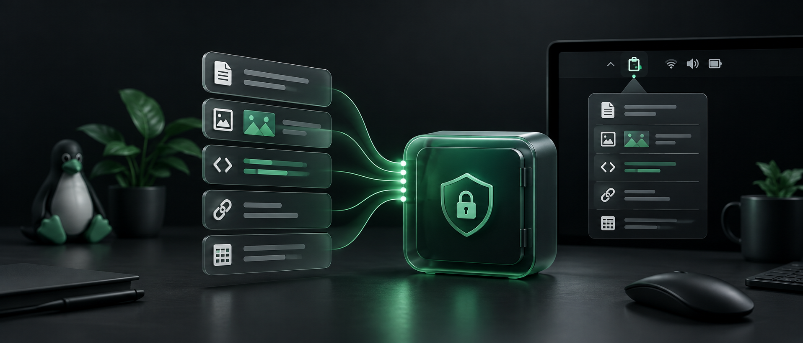
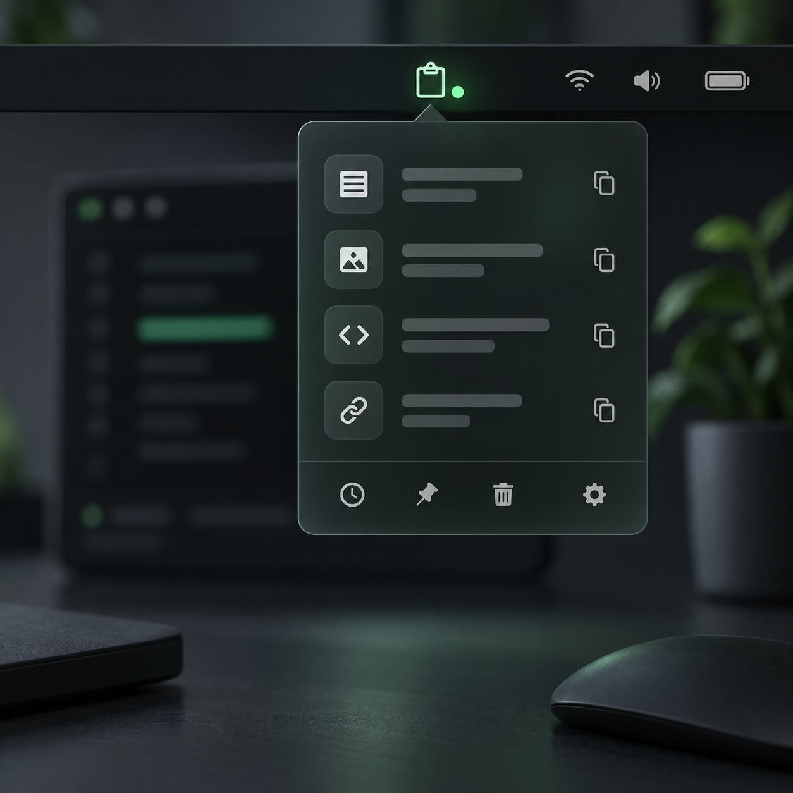

# Koplyx

Koplyx est une micro-app Linux d'historique du presse-papiers. Elle surveille les copies texte et image, stocke l'historique localement avec chiffrement applicatif, puis permet de retrouver et restaurer une ancienne copie via une fenetre compacte.

<p align="center">
  <a href="https://snapcraft.io/koplyx">
    
  </a>
</p>

<p align="center">
  
</p>

> Koplyx garde vos copies à portée de main, sans synchronisation cloud : recherchez, épinglez et restaurez vos textes, images et fichiers depuis une interface Linux compacte.

Badge Snap Store en Markdown :

[](https://snapcraft.io/koplyx)

## Présentation

Koplyx est pensé pour les personnes qui copient souvent du contenu et veulent le retrouver rapidement sans exposer leur historique à un service distant. Les données restent sur la machine, chiffrées localement, avec une recherche en mémoire quand la fenêtre est ouverte.

<table>
  <tr>
    <td width="33%" align="center">
      
      <br /><strong>Confidentialité locale</strong><br />
      Historique chiffré, clé locale et aucun compte cloud requis.
    </td>
    <td width="33%" align="center">
      
      <br /><strong>Retrouver en un clic</strong><br />
      Recherche instantanée, aperçus en mémoire et restauration rapide.
    </td>
    <td width="33%" align="center">
      
      <br /><strong>Toujours disponible</strong><br />
      Démarrage en arrière-plan, raccourci global et indicateur système.
    </td>
  </tr>
</table>

## Lancer en developpement

```bash
cd Koplyx
./bin/koplyx
```

## Fonctionnalites v1

- Historique texte, image et fichiers copies.
- Deduplication par hash.
- Apercus reels dans l'app apres dechiffrement en memoire : extrait texte, vignette image, nom de fichier.
- Recherche instantanee en memoire sur les apercus dechiffres.
- Onglet dedie aux textes epingles.
- Restauration dans le presse-papiers.
- Collage automatique apres clic via `xdotool` sur X11.
- Indicateur de barre systeme si le bureau expose AppIndicator/KStatusNotifierItem.
- Menu de barre systeme avec acces aux parametres et action quitter.
- Icone Koplyx dediee dans le lanceur et la barre systeme.
- Stockage SQLite local chiffre avec `cryptography.Fernet`.
- Cle de chiffrement stockee via Secret Service/libsecret quand disponible, avec fallback fichier local.
- Purge par nombre d'entrees, age et taille totale.
- Parametres integres.
- Dialogue de capture du raccourci clavier avec Entree pour demarrer/valider.
- Installation et synchronisation automatiques du raccourci GNOME.
- Demarrage automatique en arriere-plan par defaut.
- Fermeture de la fenetre en mise en veille, avec acces maintenu depuis la barre systeme.

## Donnees locales

- Configuration : `~/.config/koplyx/config.json`
- Cle locale : Secret Service/libsecret si disponible, sinon `~/.config/koplyx/key.bin`
- Base historique : `~/.local/share/koplyx/history.db`

Les contenus complets sont stockes dans `encrypted_blob`. Depuis `0.2.2`, les nouveaux apercus stockes dans SQLite ne reprennent plus le texte copie en clair et indiquent seulement le type, la taille ou la longueur. Depuis `0.2.4`, l'interface affiche des apercus reels en dechiffrant les entrees en memoire quand la fenetre est ouverte : extrait texte, vignette image et nom de fichier. Ces apercus visibles dans l'app ne sont pas reinjectes en clair dans SQLite. Les historiques crees avant `0.2.2` peuvent encore contenir d'anciens apercus en clair ; purger l'historique avant une publication stable si de vraies donnees ont ete utilisees pendant les tests.

Les dossiers locaux `~/.config/koplyx` et `~/.local/share/koplyx` sont durcis en `0700`, et les fichiers config, cle et base en `0600` quand le systeme de fichiers le permet. La cle reste locale sur la machine et utilise Secret Service/libsecret quand le bureau le fournit.

## Raccourci global

Le raccourci par defaut est `<Ctrl><Alt>V`. Koplyx configure automatiquement le raccourci GNOME au démarrage et après chaque modification. Il lance l'instance déjà ouverte, ou Koplyx si elle n'est pas encore démarrée :

```bash
/snap/bin/koplyx --toggle
```

Sous Wayland, le support des raccourcis globaux depend du bureau. GNOME peut accepter ce raccourci via ses parametres, mais les comportements clipboard globaux restent plus restrictifs que sous X11.

Pour modifier la combinaison dans Koplyx : ouvrir les paramètres, cliquer `Modifier`, cliquer `Démarrer` pour vider l'ancienne combinaison, choisir si besoin `Ctrl`, `Alt` ou `Super`, appuyer sur la touche principale, puis cliquer `Valider`. Le raccourci est alors appliqué immédiatement. Le bouton `Fn` est affiché comme aide, mais GNOME ne peut généralement pas enregistrer `Fn` comme modificateur.

Si le raccourci ne repond pas, il peut deja etre reserve par l'OS. Ouvrir `Parametres > Clavier > Raccourcis clavier` pour changer ou liberer le raccourci systeme.

## Fonctionnement en arriere-plan

Koplyx installe son autostart utilisateur par defaut et se lance avec `koplyx --hidden` au demarrage de session. Lorsque l'indicateur systeme est disponible, fermer la fenetre avec la croix masque Koplyx sans arreter la surveillance du presse-papiers. Pour quitter reellement le processus, utiliser `Quitter Koplyx` dans le menu de la barre systeme.

Le mode cache utilise en priorite un hote `StatusNotifierItem` pour placer Koplyx dans la barre systeme. Si cet hote est temporairement indisponible, Koplyx reste accessible par son raccourci global : la croix le masque alors sans interrompre la surveillance du presse-papiers. L'indicateur propose les actions `Afficher Koplyx`, `Parametres` et `Quitter Koplyx`.

L'autostart peut être activé ou désactivé directement avec `Lancer Koplyx au démarrage`. Dans certains environnements sandbox, l'écriture du fichier autostart utilisateur peut être refusée ; Koplyx reste utilisable et affiche un statut d'erreur.

## Installation utilisateur

```bash
cd Koplyx
./packaging/install-user.sh
```

Cela installe un lanceur dans `~/.local/bin/koplyx` et une entree desktop dans `~/.local/share/applications/dev.limax.koplyx.desktop`.
Sur X11, le script tente aussi d'installer `xdotool` via `apt` pour activer le collage automatique.

## Validation locale

```bash
cd Koplyx
./scripts/smoke-test.sh
./scripts/build-dist.sh
cd dist
sha256sum -c SHA256SUMS
```

La checklist de publication est dans `docs/PUBLIC_RELEASE.md`.
Les versions HTML statiques de la documentation sont dans `docs/html/`.
Les changements de version sont résumés dans `CHANGELOG.md`.

## Contribuer

Les contributions sont bienvenues pour les corrections de bugs, la documentation, le packaging Linux et les ameliorations ciblees de l'experience utilisateur. Lire `CONTRIBUTING.md` avant d'ouvrir une issue ou une pull request.

## Dependances optionnelles

- `xdotool` sur X11 pour coller automatiquement dans le champ actif apres un clic.
- `wtype` peut etre teste sur Wayland, mais il n'est pas une dependance du paquet `.deb`.
- Support AppIndicator/KStatusNotifierItem pour afficher Koplyx dans la zone systeme pres du Wi-Fi.
- La restauration de fichiers depend du support `text/uri-list`/`Gdk.FileList` de l'application cible.

Le collage automatique envoie volontairement `Ctrl+V` a la fenetre active apres restauration. Cette fonction doit etre testee sur l'environnement cible avant publication stable.

## Build release

```bash
cd Koplyx
./scripts/build-dist.sh
```

Le build produit `dist/koplyx-<version>-linux-source.tar.gz`, `dist/koplyx_<version>_all.deb` et `dist/SHA256SUMS`.
La GitHub Action `.github/workflows/release.yml` genere les memes fichiers en artefacts telechargeables, et les publie dans une GitHub Release quand un tag `v*` est pousse.

## Snapcraft et Flathub

- Snapcraft: `snap/snapcraft.yaml`
- Flathub/Flatpak: `packaging/flatpak/dev.limax.koplyx.yml`
- AppStream: `packaging/metainfo/dev.limax.koplyx.metainfo.xml`
- Outils packaging: `packaging/scripts/install-packaging-tools.sh`

Snapcraft et Flatpak Builder doivent etre installes localement pour construire ces paquets. Les commandes de publication sont documentees dans `docs/PUBLIC_RELEASE.md`.

## Note juridique naming

Le nom Koplyx a ete choisi apres recherche preliminaire. Ce n'est pas une garantie juridique. Avant publication publique, verifier formellement WIPO, USPTO, EUIPO et INPI.
