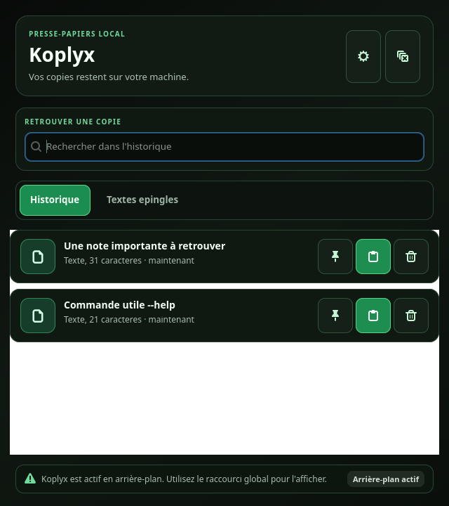

# Koplyx

Un historique du presse-papiers pour Linux, local et chiffré. Retrouvez vos textes, images et fichiers copiés, recherchez une entrée et restaurez-la depuis une fenêtre compacte.

[Télécharger](https://github.com/DemeulemeesterxMaxime/Koplyx/releases/latest) · [Notes de version](CHANGELOG.md) · [Contribuer](CONTRIBUTING.md) · [Signaler un bug](https://github.com/DemeulemeesterxMaxime/Koplyx/issues)

<p align="center">
  <a href="https://snapcraft.io/koplyx">
    
  </a>
</p>

## Distributions et installation

### Snap Store

Installez Koplyx depuis sa [page Snap Store](https://snapcraft.io/koplyx) ou sur une distribution équipée de Snap :

```bash
sudo snap install koplyx
```

Pour demander une mise à jour du canal stable :

```bash
sudo snap refresh koplyx --channel=latest/stable
```

### Debian et Ubuntu (.deb)

Téléchargez `koplyx_<version>_all.deb` dans les [GitHub Releases](https://github.com/DemeulemeesterxMaxime/Koplyx/releases/latest). Depuis le dossier de téléchargement, installez le fichier de la version choisie. Exemple pour la release `0.4.5` :

```bash
sudo apt install ./koplyx_0.4.5_all.deb
```

Pour mettre à jour, téléchargez et installez le paquet de la nouvelle release.

### Depuis les sources

Sur Debian ou Ubuntu, installez les dépendances puis lancez le projet :

```bash
sudo apt install python3 python3-gi gir1.2-gtk-4.0 gir1.2-gdkpixbuf-2.0 python3-cryptography python3-pil python3-dbus python3-secretstorage dbus-user-session xdotool
git clone https://github.com/DemeulemeesterxMaxime/Koplyx.git
cd Koplyx
./bin/koplyx
```

Vous pouvez aussi extraire l'archive source d'une release. Pour ajouter un lanceur à votre session, exécutez `./packaging/install-user.sh` depuis le dossier du projet. Le lanceur utilise ce dossier : conservez-le à son emplacement après l'installation.

### Flatpak

Le dépôt fournit un [manifeste Flatpak](packaging/flatpak/dev.limax.koplyx.yml) pour la construction locale et la préparation d'une soumission à Flathub. Les commandes et prérequis sont dans le [guide de packaging et publication](docs/PUBLIC_RELEASE.md).

## Releases

Les [GitHub Releases](https://github.com/DemeulemeesterxMaxime/Koplyx/releases) regroupent les versions publiées et leurs fichiers :

- `koplyx_<version>_all.deb` : paquet Debian et Ubuntu.
- `koplyx-<version>-linux-source.tar.gz` : archive source.
- `SHA256SUMS` : sommes de contrôle des deux artefacts.

Téléchargez les deux artefacts et `SHA256SUMS` dans le même dossier, puis vérifiez leur intégrité :

```bash
sha256sum -c SHA256SUMS
```

Le projet suit Semantic Versioning (`MAJOR.MINOR.PATCH`), avec [VERSION](VERSION) comme source de vérité. Le [changelog](CHANGELOG.md) détaille les évolutions et correctifs.

Le [workflow de release](.github/workflows/release.yml) vérifie les pull requests vers `main` et construit les artefacts Linux et Snap. Les tags `v*` déclenchent la publication GitHub ; la publication Snap stable dépend des identifiants du Store configurés dans la CI. Attendez la réussite complète de la CI avant une fusion ou une publication. Consultez le [guide de publication](docs/PUBLIC_RELEASE.md) pour la procédure complète.

## Utiliser Koplyx

<p align="center">
  
</p>

- Recherchez parmi les textes, images et fichiers copiés.
- Épinglez les textes, images et fichiers à conserver. Le filtre global choisit si les épingles apparaissent en haut, en bas ou uniquement dans l'onglet `Épinglés`.
- Cliquez sur une ligne pour restaurer puis coller immédiatement l'élément dans la fenêtre précédente, sans créer une nouvelle entrée d'historique.
- Ouvrez la fenêtre avec `Ctrl+Alt+V`, configurable dans les paramètres et installé automatiquement sous GNOME.
- Le menu de la barre système propose `Afficher Koplyx`, `Paramètres` et `Quitter Koplyx`. L'historique se consulte dans la fenêtre principale.

Koplyx peut démarrer en arrière-plan à l'ouverture de session. Le collage direct utilise `xdotool` sous X11 et le portail du bureau sous Wayland. Sur Wayland, ouvrez Paramètres et autorisez le clavier dans la demande GNOME, parfois intitulée « Bureau à distance ». Koplyx ne demande ni partage d'écran ni contrôle de souris. Le portail reçoit une demande persistante et Koplyx réutilise le jeton fourni après un redémarrage, sans nouvelle fenêtre lorsque le bureau l'accepte. Le bureau peut révoquer cette autorisation dans ses paramètres de confidentialité. Sans autorisation, un clic restaure tout de même le contenu dans le presse-papiers et vous pouvez utiliser Ctrl+V. Le bureau doit fournir le portail RemoteDesktop ; l'indicateur nécessite un hôte AppIndicator/KStatusNotifierItem.

Les contenus sont chiffrés avant leur stockage local dans SQLite et les aperçus sont déchiffrés en mémoire. La clé utilise Secret Service/libsecret si disponible, avec un fichier local en solution de repli. Consultez la [politique de sécurité](SECURITY.md) pour les précautions concernant les anciens historiques.

## Contributions

Koplyx est un projet open source sous [licence MIT](LICENSE). Les contributions sont bienvenues : corrections de bugs, documentation, accessibilité, packaging et tests sur différentes distributions Linux.

1. Consultez les [issues](https://github.com/DemeulemeesterxMaxime/Koplyx/issues) et ouvrez une discussion avant une modification importante.
2. Lisez le [guide de contribution](CONTRIBUTING.md) et le [code de conduite](CODE_OF_CONDUCT.md).
3. Créez une branche dédiée et effectuez les vérifications locales.
4. Ouvrez une pull request vers `main` avec une description du changement, les tests effectués et les limites connues sur X11, Wayland, Snap ou Flatpak.

Pour un bug, indiquez la version, la distribution, le bureau, le type de session et la méthode d'installation, avec les étapes de reproduction. Pour une vulnérabilité, suivez la [procédure de signalement privé](SECURITY.md).

### Vérifier et construire

Depuis la racine du dépôt, avec les dépendances de développement et de packaging installées :

```bash
./scripts/smoke-test.sh
/usr/bin/python3 -m py_compile scripts/build-html-docs.py koplyx/main.py koplyx/__init__.py
./scripts/build-dist.sh
(cd dist && sha256sum -c SHA256SUMS)
```

Le build génère les paquets dans `dist/` et régénère les [pages HTML de documentation](docs/html/index.html) avec [le script dédié](scripts/build-html-docs.py). Ne versionnez pas les paquets générés ni les données personnelles de l'application.

Les ressources de packaging comprennent le [manifeste Snap](snap/snapcraft.yaml), le [manifeste Flatpak](packaging/flatpak/dev.limax.koplyx.yml), les [métadonnées AppStream](packaging/metainfo/dev.limax.koplyx.metainfo.xml) et les [outils de packaging](packaging/scripts/install-packaging-tools.sh). La [checklist manuelle](tasks/TESTS-MANUELS.md) complète les contrôles automatisés.
